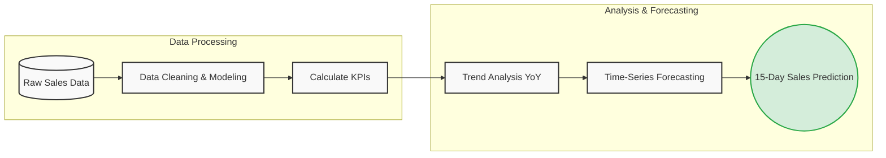

# 📊 Sales Performance Dashboard

<div align="center">
  
  
  
  <br>
  
</div>

---

## 📝 Project Overview
This repository contains the deliverables for **Project 1** of the Syntecxhub Data Analysis Internship. The goal of this project is to build an interactive dashboard to monitor key sales performance metrics, evaluate trends, and forecast future sales over a 15-day period.

By tracking total sales, profit, and order quantities across various dimensions like state, category, and time, businesses can identify high-performing areas and address underperforming ones to optimize their sales strategy.

## 🎯 Objectives
*   **🧹 Data Preparation:** Clean and model sales and profitability data for accurate reporting.
*   **📈 KPI Tracking:** Monitor key metrics like Sales, Profit, Quantity, and Average Delivery Days.
*   **👥 Regional & Category Analysis:** Analyze performance across different states, shipping modes, customer segments, and product categories.
*   **🔮 Sales Forecasting:** Implement time-series forecasting to predict sales for the upcoming 15 days.
*   **📊 Visualization:** Develop a comprehensive, interactive dashboard for dynamic data exploration.

## 🛠️ Tools Used
*   **Power BI:** Used for data visualization, building the interactive dashboard, trend analysis, and forecasting.

---

## 💡 Key Insights & Findings

Based on the interactive dashboard analysis, several critical business insights were discovered:

| Insight Area | Description | Actionable Recommendation |
| :--- | :--- | :--- |
| **🏆 Top Selling Categories** | **Office Supplies** drive the highest sales (0.15M), with Chairs, Binders, and Phones being the most popular subcategories. | Ensure sufficient inventory and consider cross-selling strategies for these top items. |
| **🌍 Regional Performance** | **California (0.34M)** and **New York (0.19M)** are the leading states in total sales, representing major revenue hubs. | Focus marketing budgets heavily in these high-converting states while exploring untapped regions. |
| **💳 Payment Preferences** | **Cash on Delivery (COD)** (41%) and **Online** (39%) are the most preferred payment modes. | Ensure logistics are optimized for COD handling and promote online payments to reduce delivery friction. |
| **🚚 Shipping Modes** | **Standard Class** (78K) is overwhelmingly the preferred shipping method. | Negotiate better rates for standard shipping to reduce costs and improve overall profit margins. |

---

## 🧠 What is Sales Forecasting?

Sales forecasting is the process of estimating future revenue by predicting the amount of product or services a sales unit will sell in the next week, month, quarter, or year. 

> [NOTE]
> **Why use Forecasting?** Accurate sales forecasts allow business leaders to make smarter decisions about hiring, inventory management, goal setting, and budgeting.

### Key Metrics Monitored:
1.  💵 **Total Sales & Profit:** Tracking overall revenue and bottom-line health.
2.  📦 **Quantity:** Understanding product volume.
3.  ⏱️ **Average Delivery Days:** Ensuring customer satisfaction and logistical efficiency.



---

## 📁 Repository Structure

```text
📂 Syntecxhub_Sales_Performance_Dashboard/
├── 📊 Sales Performance Dashboard.pbix   # Power BI Dashboard (Source File)
├── 📄 Sales Performance Dashboard.pdf    # Exported PDF version for quick viewing
└── 📖 README.md                          # Project documentation (You are here!)
```

## 🚀 How to View the Dashboard
1. Ensure you have [Power BI Desktop](https://powerbi.microsoft.com/desktop/) installed on your machine.
2. Clone this repository or download the `.pbix` file.
3. Open the `Sales Performance Dashboard.pbix` file in Power BI Desktop to interact with the dashboard, view the data model, and explore the visualizations.
4. Alternatively, view the static report by opening the `.pdf` file.

---

<div align="center">
  <b>🌟 Completed as part of the Syntecxhub Data Analysis Internship Program 🌟</b>
</div>
